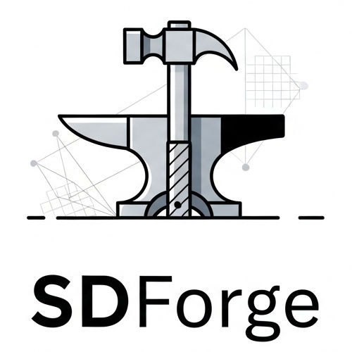

<p align="center">
  <picture>
    <source srcset="./assets/logo_dark.png" media="(prefers-color-scheme: dark)">
    <source srcset="./assets/logo_light.png" media="(prefers-color-scheme: light)">
    
  </picture>
</p>


SDF Forge is a Python library for creating 3D models using Signed Distance Functions (SDFs). It provides a real-time, interactive rendering experience in a native desktop window, powered by GLSL raymarching.

## Features

- **Simple, Pythonic API:** Define complex shapes by combining primitives using standard operators (`|`, `-`, `&`).
- **Real-time Native Rendering:** Get instant visual feedback in a lightweight native window powered by `moderngl` and `glfw`.
- **Hot-Reloading:** Save your Python script and the 3D view updates instantly, without restarting.
- **Mesh Exporting:** Save your creations as `.stl` files for 3D printing or use in other software, using the Marching Cubes algorithm.
- **Google Colab Support:** Works seamlessly in Colab notebooks, embedding the viewer directly in the output cell.
- **Custom GLSL with `Forge`:** Power users can write custom SDF logic directly in GLSL and integrate it into the Python workflow.

## Quick Start

```python
from sdforge import *

# A sphere intersected with a box
f = sphere(1) & box(1.5)

# Subtract three cylinders along each axis
c = cylinder(0.5)
f -= c.orient(X) | c.orient(Y) | c.orient(Z)

# Render a live preview in a native window.
# With watch=True, the view will update when you save the file.
f.render(watch=True)
```

## Custom GLSL with `Forge`

For complex or highly-performant shapes, you can write GLSL code directly. This object integrates perfectly with the rest of the API.

```python
from sdforge import *

# A standard library primitive
s = sphere(1.2)

# A custom shape defined with GLSL
# 'p' is the vec3 point in space
custom_twist = Forge("""
    float k = 10.0;
    float c = cos(k*p.y);
    float s = sin(k*p.y);
    mat2  m = mat2(c,-s,s,c);
    vec3  q = vec3(m*p.xz,p.y);
    return length(q) - 0.5;
""")

f = s - custom_twist

# Rendering works out of the box
f.render()

# Saving a mesh with Forge also works directly
f.save('example_inline.stl')
```

## Installation

The library and its dependencies can be installed using pip:

```bash
pip install sdforge
```

Or, for the latest version directly from GitHub:
```bash
pip install git+https://github.com/yourusername/sdforge.git
```

## Acknowledgements

This project is heavily inspired by the simplicity and elegant API of Michael Fogleman's [fogleman/sdf](https://github.com/fogleman/sdf) library. SDF Forge aims to build on that foundation by adding a real-time, interactive GLSL-powered renderer.